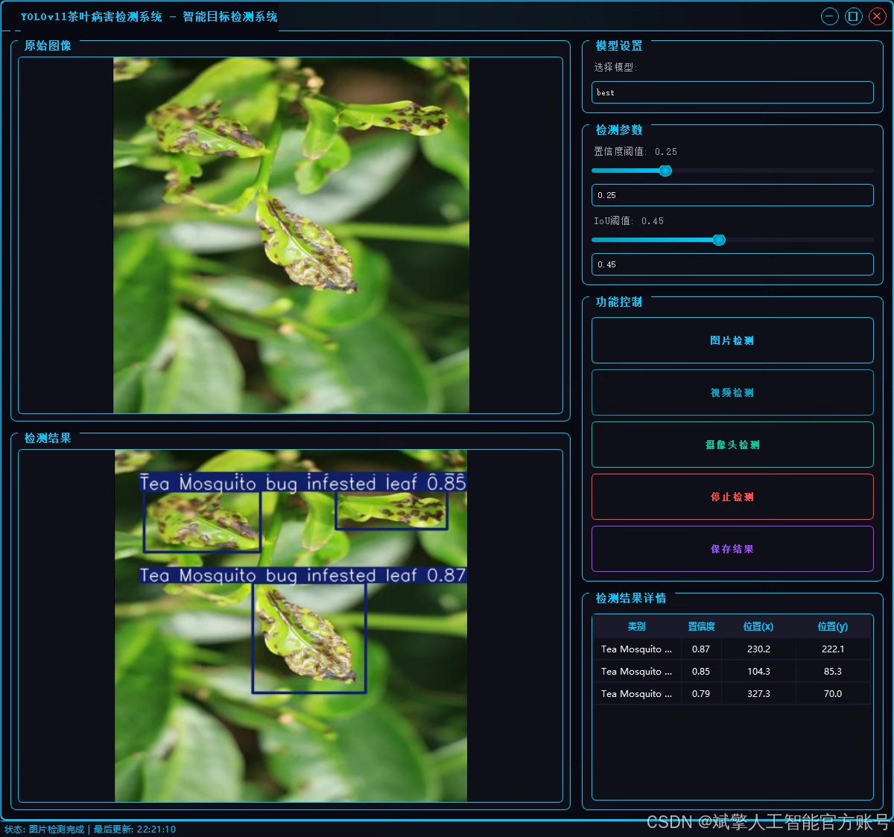
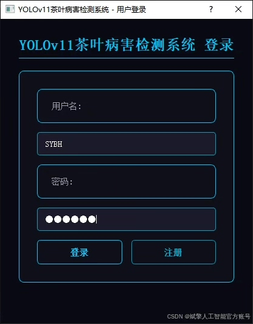
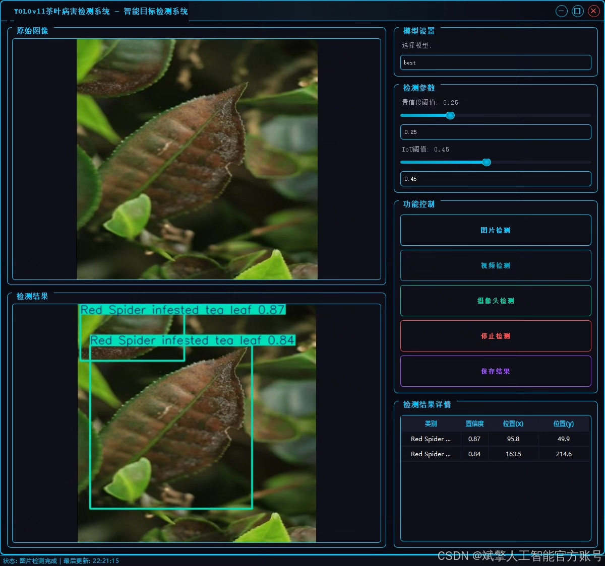
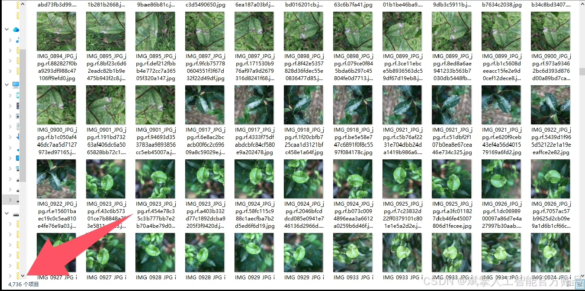
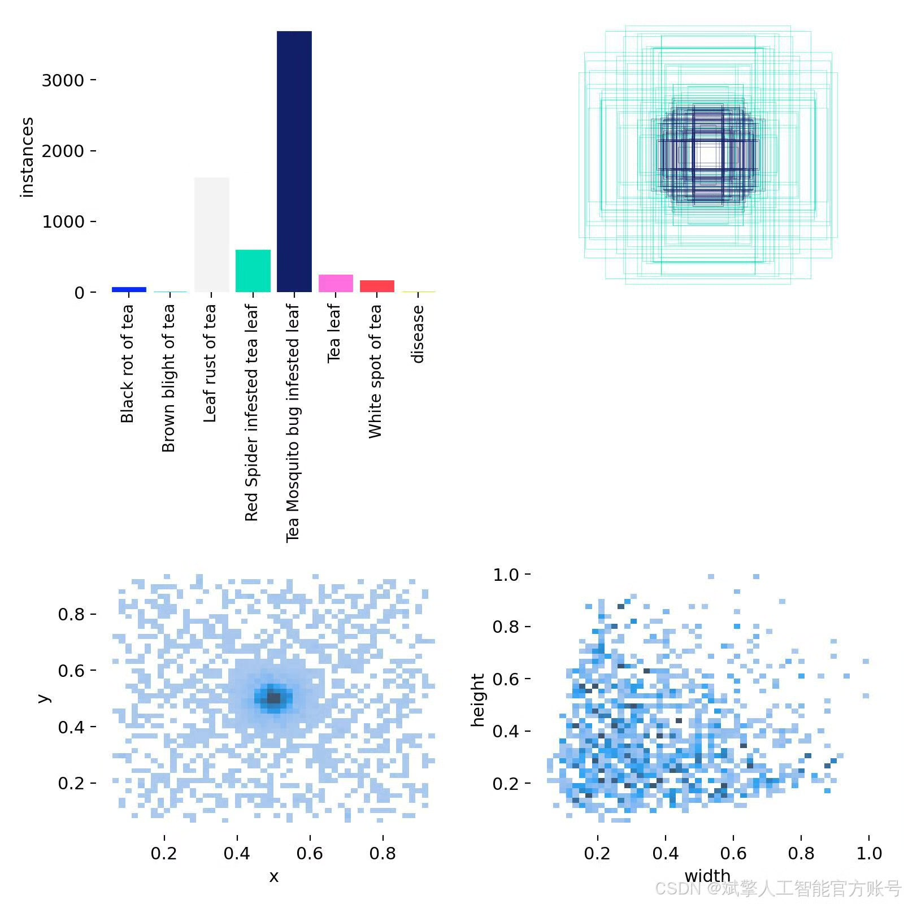
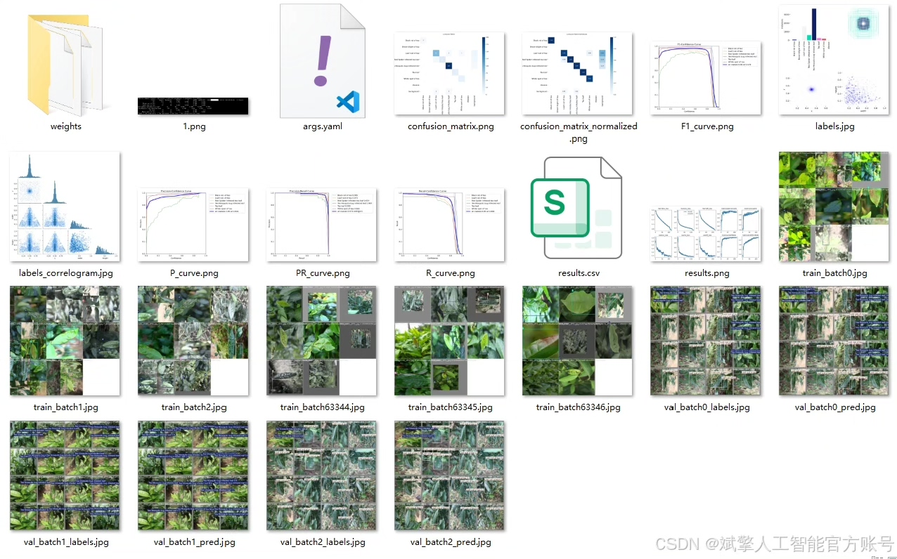
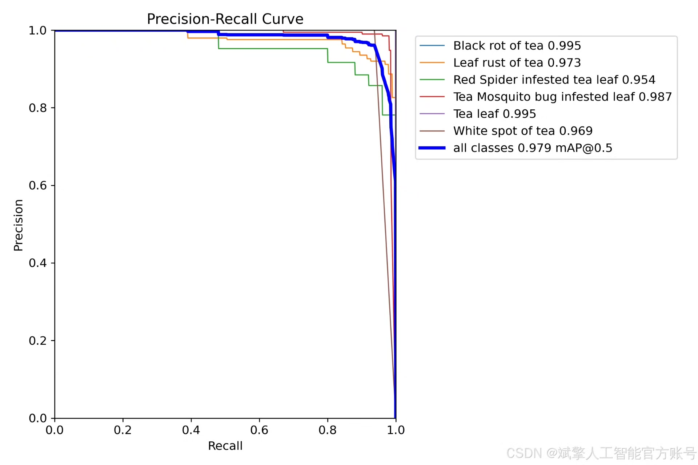
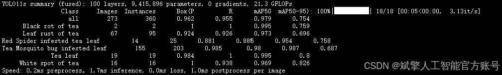
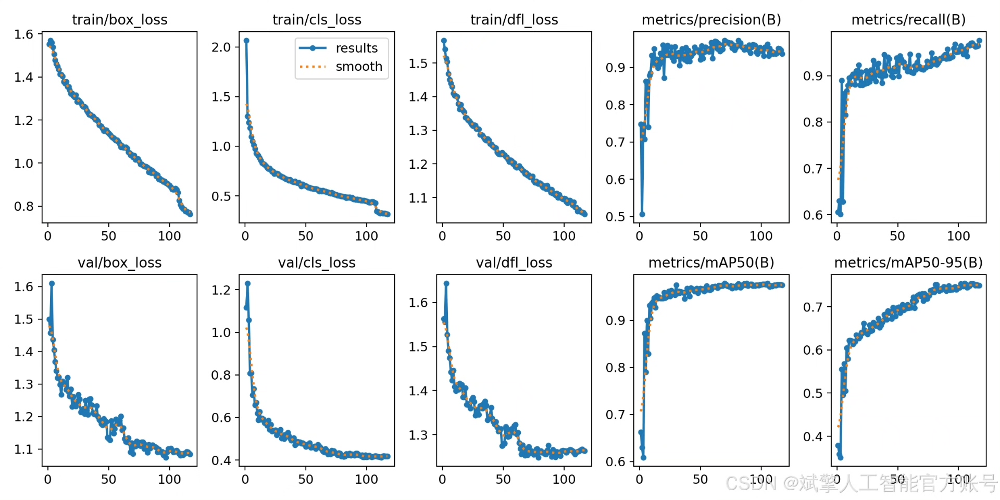

# YOLOv11 Tea Disease Detection Software Development

## Body

YOLOv11 Tea Disease Detection Software Development Based on Deep Learning YOLOv11: A Tea Disease Detection System (YOLOv11+YOLO dataset + UI interface + login and registration interfaces + Python project source code + model)

nc: 8 classes,
Names: ['Black rot of tea', 'Brown blight of tea', 'Leaf rust of tea', 'Red Spider infested tea leaf', 'Tea Mosquito bug infested leaf', 'Tea leaf', 'White spot of tea', 'disease'],
Dataset size: training set 4736 images, validation set 273 images, test set 406 images.

✅ User Login and Registration: Supports password detection and security verification.

✅ Three detection modes: based on the YOLOv11 model, supports image, video, and real-time camera detection, accurately identifying targets.

✅ Dual-screen comparison: display original images and detection results on the same screen.

✅ Data visualization: real-time table displays the category, confidence, and coordinates of detected targets.

✅ Intelligent parameter adjustment: provides a confidence slide bar to dynamically optimize detection accuracy, adapting to different scene requirements.

✅ Sci-fi style interactive interface: dark theme combined with dynamic light effects, reducing visual fatigue and improving operational experience.

## Images

## Payment

Here is a pay link on Stripe ( https://buy.stripe.com/3cs8yP7sY87d0vu9AB ). Please contact me lonlonago@foxmail.com after funding $89, and I will send you a complete data files , thank you!

